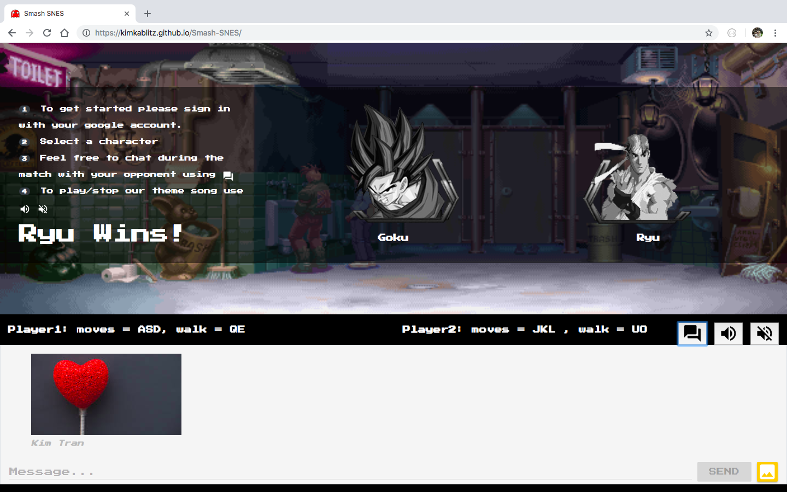

# Smash-SNES

## Part 1- our MVP:

#### Idea: To build an online street fight game with our favorite comic characters while chatting live with other players.

#### Target Audience: More popular among the older generation who enjoy street fights but also attracts the younger generation for its live features such as chatting and exciting theme song.

#### Problem: We try to implement as many APIs and features into our product to meet class requirements but at the same time expand our creativity to recreate one of our favorite games."

#### Goal: Our goal is to provide a secure and easy to use online game platform that is suitable for our target users.

### User Stories:
  1. As a user, I want to be able to log in easily via Google.
  2. As a user, I want to be able to play as our favorite comic icons while chatting.
  3. As a user, I want to be able to connect with players via our chatboard. 

- Nice-To-Haves
  * emojis for chat
  * opening game page
  * medals for winners
  
 ## Part 1- Street-Fight Game as a glance:

 ### Highlights of our game features
 

 

  
  #### Instructions:
  * Log in
  * Press keys to move characters according to our instructions per player
  * Hit opponents to lower their HP
  * Tap music icons to listen to our theme song
  * Tap chatbox to start a conversation.
  
  
 ### Material and Tools
  * Node.js
  * [Sound.js](https://www.createjs.com/soundjs)
  * [Material Design Lite](https://github.com/google/material-design-lite)
  * [Google Firebase Plaform](https://firebase.google.com)
  * [Sprite.js library](https://spritejs.readthedocs.io/en/latest/)
 
### Copyrights and Acknowledgements
  * [Privacy](https://termsfeed.com/privacy-policy/6cf81f38974eab1bf5dc46b1e06725e6)
  * [Terms & conditions](https://termsfeed.com/terms-conditions/0014ae28a1cef6301fb4b9fb42109b40)